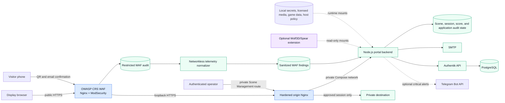
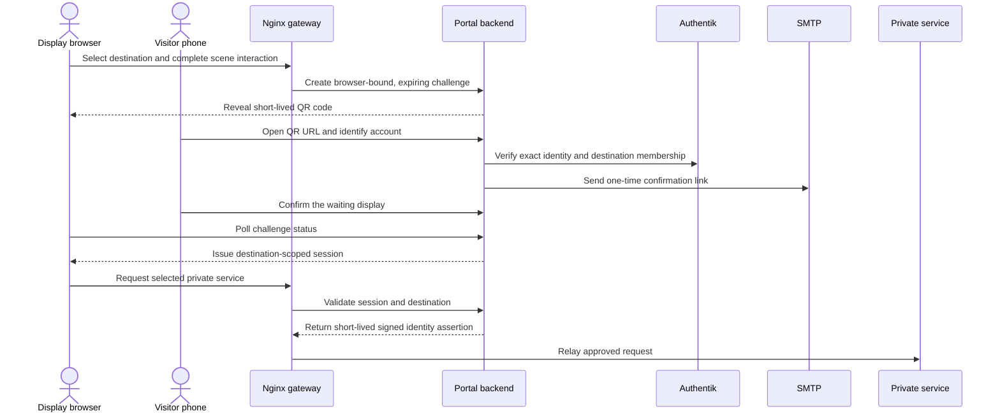
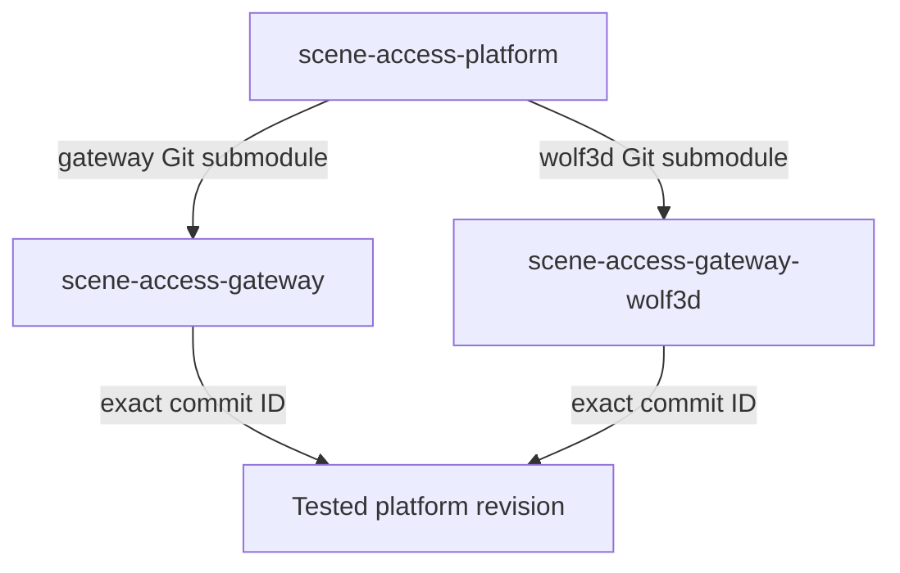

# Scene Access Platform

[](https://github.com/zipkindev/scene-access-platform/actions/workflows/ci.yml)
[](https://github.com/zipkindev/scene-access-gateway)
[](https://github.com/zipkindev/scene-access-gateway-wolf3d)
[](https://docs.docker.com/compose/)
[](LICENSE)

Scene Access Platform is a self-hosted, scene-driven access gateway for private
applications. It replaces a conventional login landing page with an authored,
interactive environment: visitors discover a destination, complete its scene
interaction, approve a short-lived access handoff from a phone, and continue
to the selected service. Operators manage scenes, destination access requests,
security events, identity integration, and optional interactive extensions from
the same system.

This repository is the integration and release authority for the project. It
pins compatible revisions of the core Gateway and the optional Wolf3D/Spear
extension, assembles their Compose models, and validates the exact combination
that operators run.

## Product overview

The platform combines four areas that are often separate systems:

- **Scene-based access:** responsive visual scenes, destination hotspots,
  ordered activation sequences, QR challenges, and browser-bound handoffs.
- **Scene Management:** artwork ingestion, image optimization, TV and phone
  framing, hotspot authoring, drafts, publishing, revision history, access
  review, and security monitoring.
- **Identity-aware proxying:** Authentik-backed identity and group checks,
  email confirmation, destination-scoped sessions, and short-lived signed
  assertions for approved upstream services.
- **Extensible experiences:** a versioned extension boundary for independently
  licensed browser runtimes, demonstrated by the Wolfenstein 3D and Spear of
  Destiny integration without distributing commercial game data.

### Scene authoring


Scene Management works in image-relative coordinates so authored hotspots and
framing survive different viewport sizes. Operators can define up to ten
ordered interaction points, preview the resulting experience, publish an
immutable revision, and roll back without rebuilding an image.

### Security operations


The protected security console correlates portal visits, QR outcomes, access
requests, session creation, rejected routes, rate limits, and scanner or
injection indicators. Optional GeoLite2 enrichment is performed locally; the
application does not send visitor addresses to a third-party lookup service.
Scene Management places approximate country, region, city, and ASN context
beside each public source address and supports removable, composable filters
for severity, event and alert category, detected country, exact IP, and CIDR
range. MaxMind account onboarding, protected database downloads, updates, and
credential removal are available in the same console.
Operators can configure Telegram alerts for selected severities and categories,
with aggregation, target-aware incident deduplication, persistence reminders,
hourly limits, UTC quiet hours, critical-event override, redaction, delivery
status, and a test action in the same console. A networkless sidecar normalizes
the restricted WAF audit stream into the same integrity-protected ledger, so
operators can filter application and WAF findings separately while retaining
one investigation and notification surface.
The bot token is accepted through a write-only administration field, verified
with Telegram, stored as a protected server-side file, and never returned to
the browser. Scene Management discovers the numeric destination ID after the
operator messages the bot.
The screenshot uses an RFC-reserved documentation address and contains no
production identity or infrastructure data.

## System architecture



For deployments using the tracked WAF component, the WAF Nginx process is the
only intended public HTTP entrypoint. It embeds ModSecurity and OWASP CRS,
drops unknown hosts, and forwards accepted traffic to a separate hardened
origin Nginx listener over loopback. The Node.js backend and identity services
remain private. The telemetry normalizer has no network, application state,
Telegram credentials, or Docker socket; the backend receives only bounded
findings without headers, bodies, cookies, authorization values, or query
values. Portable deployments may run the origin without the optional
WAF, but must preserve the same public/private boundary. Scene state, keys,
credentials, licensed audio, GeoIP databases, commercial game data, and
host-specific policy are mounted at runtime rather than embedded in images.

The production layout is one Compose application with six cooperating
services, not two competing WAF implementations:

| Service | Responsibility |
| --- | --- |
| `access-waf` | Public TLS edge: Nginx loads ModSecurity 3.0.16, which evaluates OWASP CRS 4.29.0 rules before proxying the request. |
| `access-proxy` | Private hardened origin Nginx: canonical-host routing, management-route isolation, request limits, and upstream policy. |
| `access-portal` | Portal, Scene Management, security ledger, WAF ingestion, incident correlation, and optional Telegram delivery. |
| `waf-telemetry` | Networkless, continuously running normalizer with read-only raw-audit access and a dedicated sanitized output volume. |
| `cert-reloader` | Origin certificate reload health and lifecycle. |
| `waf-cert-reloader` | Public WAF certificate reload health and lifecycle. |

Raw ModSecurity transaction identifiers are retained only when they already
match the bounded ledger identifier contract; other valid identifiers are
replaced with stable SHA-256-derived correlation IDs. Initial audit backfill is
marked historical, remains visible in Scene Management, and cannot enqueue
Telegram alerts. New findings enter the normal source/target/category incident
flow, where the first qualifying event alerts, duplicates aggregate, and
persistent activity can re-alert without deleting any ledger records.

The WAF is intentionally deployed in `DetectionOnly` for a one-week baseline.
During that period, operators review passed, origin-rejected, rate-limited, and
edge findings alongside application events. On or after the review window,
high-confidence CRS rules can be enabled in small groups only after false
positives and representative portal, QR, login, editor, asset, and private
service flows have been checked. The origin and application controls stay in
force in both modes.

Any additional public portal hostname is an explicit deployment alias rather
than a wildcard. The WAF, origin Nginx, and backend allowlists must agree; the
backend normalizes the trusted proxy's external/default and canonical origin
ports while rejecting unconfigured names and arbitrary ports.

### Access handoff



An access request does not grant access by itself. Unknown or unauthorized
visitors enter a destination-specific review queue. An operator must approve
the request and establish the required identity membership before the visitor
starts a new handoff.

## Repository architecture

The platform is intentionally split across three public repositories:

| Repository | License | Responsibility |
| --- | --- | --- |
| [`scene-access-platform`](https://github.com/zipkindev/scene-access-platform) | Apache-2.0 | Compatible component revisions, combined Compose lifecycle, integration CI, synchronization policy, and operator entry point |
| [`scene-access-gateway`](https://github.com/zipkindev/scene-access-gateway) | Apache-2.0 | Portal frontend, Node.js backend, Scene Management, Authentik contracts, security ledger, reusable OWASP CRS WAF component, artwork, and portable container images |
| [`scene-access-gateway-wolf3d`](https://github.com/zipkindev/scene-access-gateway-wolf3d) | GPL-3.0 | uWolf-derived runtime, CRT integration controller, supported-data manifest, safe game-data importer, and extension tests |



Each submodule entry is a Git link to one component commit. The Platform
history does not duplicate component source: it records the exact Gateway and
Wolf revisions that passed integration testing together. Each component keeps
its own review history, CI, release boundary, and license.

This separation is functional rather than cosmetic:

- the Gateway remains independently buildable without an optional game runtime;
- GPL extension source remains outside the Apache-2.0 application history;
- commercial Wolfenstein 3D and Spear of Destiny data remains user-supplied;
- component changes can be reviewed and tested independently;
- a Platform revision provides a reproducible, auditable compatibility pair.

## Technology and engineering scope

| Area | Implementation |
| --- | --- |
| Edge and routing | Hardened origin Nginx plus optional OWASP CRS 4.29.0/ModSecurity 3.0.16 WAF, normalized token-safe logs, host/probe/management-route denials, bounded connections, private upstream network, health checks |
| Application | Node.js 22, browser-native JavaScript, strict host/method/body handling, durable JSON-backed state contracts |
| Identity | Authentik API integration, optional Authentik worker and PostgreSQL Compose overlay |
| Authorization | Browser-bound QR challenges, email confirmation, destination membership, scoped sessions, signed assertions |
| Scene system | Versioned scene schema, responsive framing, hotspot sequences, motion bundles, immutable revisions |
| Security visibility | Ordered asynchronous event ledger, bounded retention, sanitized WAF ingestion, application/WAF stream filters, keyed incident deduplication and reminders, optional offline GeoIP/ASN enrichment, and policy-controlled Telegram alerts |
| Packaging | Dockerfiles, Docker Compose overlays, digest-pinned base images, deterministic asset archives |
| Quality gates | Node test runner, syntax checks, manifest/hash verification, container builds, isolated runtime smoke tests |
| Extension model | Read-only runtime/controller mounts and independently licensed component repositories |

## Security and data boundaries

The platform is designed around explicit trust boundaries:

1. Only the selected edge is intended to receive public traffic: the WAF when
   enabled, otherwise the portable Nginx gateway. A WAF deployment keeps its
   separate origin listener private or loopback-only.
2. The backend administration listener is private and must not be published
   directly.
3. Authentik remains the identity authority; API credentials are mounted with
   the minimum scope required for approved operations.
4. Public clients never receive upstream credentials, private service
   addresses, signing keys, or Authentik management tokens.
5. Security records exclude request bodies, query strings, passwords,
   QR/session tokens, and raw email identities.
6. Telegram credentials are stored as protected server-side files or supplied
   through optional external mounts; alert payloads use the configured masked
   or country-only source representation.
7. Scanner and injection classifications are investigation signals, not claims
   that an exploit succeeded.
8. Production TLS, trusted-proxy policy, storage, secrets, backups, and network
   segmentation belong to reviewed environment-specific configuration.
9. Public ingress denies the TorrentHarbor management API and strips caller
   trust headers; management authorization uses the direct peer on the private
   backend network.
10. A deployment WAF supplements the portable edge and application checks. New
    rules remain in observation mode until representative portal, editor, and
    service flows pass; the portable one-day HSTS starter policy is preserved
    and lengthened at TLS termination only after validation.

Protected local inputs are deliberately excluded from all three repositories:

| Input | Local location or mechanism |
| --- | --- |
| Gateway environment | `gateway/.env` |
| Secrets and licensed audio | `gateway/.local/` |
| Wolf/Spear commercial data | `wolf3d/runtime/*.WL*`, `*.SOD`, and `*.SD*` |
| Platform deployment override | `.local/compose.override.yaml` |
| TLS, proxy, storage, and network policy | Protected local mounts or target secret/configuration system |
| GeoIP credentials and databases | Protected persistent state, or a read-only directory selected by `SAG_GEOIP_DIR` |

Tracked engine source also lives under `wolf3d/runtime/`; only the commercial
game-data extensions are ignored. Tests fail if a matching commercial dataset
is accidentally tracked.

## Getting started

### Requirements

- Git with submodule support
- Docker Engine
- Docker Compose v2
- Node.js 22 or newer for host-side validation

### Clone and bootstrap

```sh
git clone --recurse-submodules https://github.com/zipkindev/scene-access-platform.git
cd scene-access-platform
./scripts/bootstrap.sh
```

For an existing checkout whose submodules are not initialized:

```sh
git submodule update --init --recursive
```

Bootstrap creates missing ignored local directories and a safe development
environment file. It preserves existing local configuration and already
initialized component branches.

### Validate, build, and run

```sh
./scripts/test.sh
./scripts/build.sh
./scripts/up.sh
```

The default development endpoints bind to loopback:

| Endpoint | URL | Purpose |
| --- | --- | --- |
| Portal | <http://localhost:8080> | Interactive scene and visitor access flow |
| Scene Management | <http://localhost:8081> | Local authoring, review, and security workspace |

Stop the stack with:

```sh
./scripts/down.sh
```

The root lifecycle scripts combine `gateway/compose.yaml` with
`wolf3d/compose.extension.yaml` and export the extension path automatically.
When `.local/compose.override.yaml` exists, the same scripts include it as the
final environment-specific layer.

### Optional Wolf3D/Spear data

The extension repository contains GPL runtime source and integration logic but
no commercial game data. Import legally obtained supported files from the
Platform root:

```sh
./wolf3d/scripts/import-game-data.sh /path/to/owned/game/files WL6
./wolf3d/scripts/import-game-data.sh /path/to/owned/game/files SOD
./wolf3d/scripts/verify-game-data.sh ALL
```

The importer validates the complete selected dataset against pinned filenames,
byte lengths, and SHA-256 identities before installing anything.

## Validation and continuous integration

`./scripts/test.sh` is the Platform acceptance gate. It performs:

- workspace topology and protected-path checks;
- Markdown link and image validation across all three repositories;
- Gateway source, configuration, scene, security, persistence, and API tests;
- artwork, optional-audio, and pinned-container-base verification;
- Wolf source identity, transition-contract, and commercial-data exclusion tests;
- frontend and backend container builds;
- an isolated combined Gateway/Wolf Compose smoke test.

The same integration entry point runs in GitHub Actions from clean public
checkouts. Component repositories also run their own focused CI so defects are
caught before the Platform pointer is updated.

## Development and synchronization

Changes belong in the repository that owns the affected behavior. The Platform
records the final tested integration state.

### Local-first change

```text
component feature branch
    -> component tests
    -> component commit and pull request
    -> component main merge
    -> update Platform submodule pointer
    -> Platform integration tests
    -> Platform commit and pull request
```

### Remote-first update

With all three worktrees clean:

```sh
./scripts/update-components.sh
```

The script switches each component to `main`, pulls with `--ff-only`, runs the
complete integration suite, and leaves the new submodule pointers for review.
The pointer update becomes a separate Platform commit only after validation.

### Working-tree rules

- Run `git status` separately at the Platform root, in `gateway/`, and in
  `wolf3d/`; each is an independent Git worktree.
- Commit application changes inside the owning component repository.
- Publish component commits before publishing a Platform commit that points to
  them.
- Never use force-add to include ignored secrets, media, or game data.
- Do not use copied component trees as an alternative synchronization path.

The full automation and safety policy is documented in [`AGENTS.md`](AGENTS.md).

## Repository layout

```text
scene-access-platform/
├── .github/workflows/ci.yml     # Cross-repository integration CI
├── gateway/                     # scene-access-gateway Git submodule
├── wolf3d/                      # scene-access-gateway-wolf3d Git submodule
├── scripts/
│   ├── bootstrap.sh             # Initialize missing components and local inputs
│   ├── check-docs.mjs           # Validate local Markdown links and images
│   ├── check-workspace.sh       # Enforce repository and protected-data boundaries
│   ├── test.sh                  # Complete acceptance suite
│   ├── build.sh                 # Build the portable Gateway images
│   ├── up.sh / down.sh          # Combined Compose lifecycle
│   └── update-components.sh     # Fast-forward and validate component main branches
├── AGENTS.md                    # Automation, Git, validation, and deployment policy
├── .gitmodules                  # Canonical component repository URLs
└── README.md
```

## Deployment model

The tracked Compose files are portable and environment-neutral. Supported
delivery patterns include local development, locally built Compose deployment,
registry-backed images, and air-gapped image export/import. Authentik,
PostgreSQL, and offline GeoIP are optional overlays.

TrueNAS and other production targets use the same images with protected local
configuration. Source synchronization, CI success, and image builds do not
authorize a production deployment. A cutover requires a separately reviewed
procedure covering the exact target, image versions or digests, configuration
mounts, network exposure, certificates, backups, rollback, health checks, and
active-session handling, followed by explicit approval.

## Project status

The public repositories contain the portable application, verified artwork,
optional extension source, reproducible build inputs, automated tests, and
integration workflows. Current local and GitHub CI validation covers the core
Gateway, Scene Management, security ledger, asset pipeline, Wolf extension,
container builds, and combined runtime.

Security monitoring includes configurable Telegram alert policy and delivery
controls while keeping credentials environment-local. The Gateway also
normalizes access logs to exclude queries and one-time URL tokens, drains event
writes on shutdown, avoids state rewrites for read-only requests, and applies
browser isolation and immutable versioned-asset caching. Production environment
configuration and commercial or locally licensed content remain intentionally
outside the public source tree.

## Licensing and third-party boundaries

- Platform orchestration and documentation: [Apache-2.0](LICENSE)
- Gateway software: [Apache-2.0](https://github.com/zipkindev/scene-access-gateway/blob/main/LICENSE)
- Project-generated Gateway artwork: CC BY 4.0 with per-asset provenance
- Wolf3D/Spear extension source: [GPL-3.0](https://github.com/zipkindev/scene-access-gateway-wolf3d/blob/main/LICENSE)
- Optional third-party audio: locally supplied under its recorded source terms;
  raw files are not distributed by the repositories
- Wolfenstein 3D and Spear of Destiny data: user supplied and never distributed

Wolfenstein 3D, Spear of Destiny, id Software, Bethesda, ZeniMax, Microsoft,
and related names and content belong to their respective owners. The extension
is not affiliated with or endorsed by those organizations.
