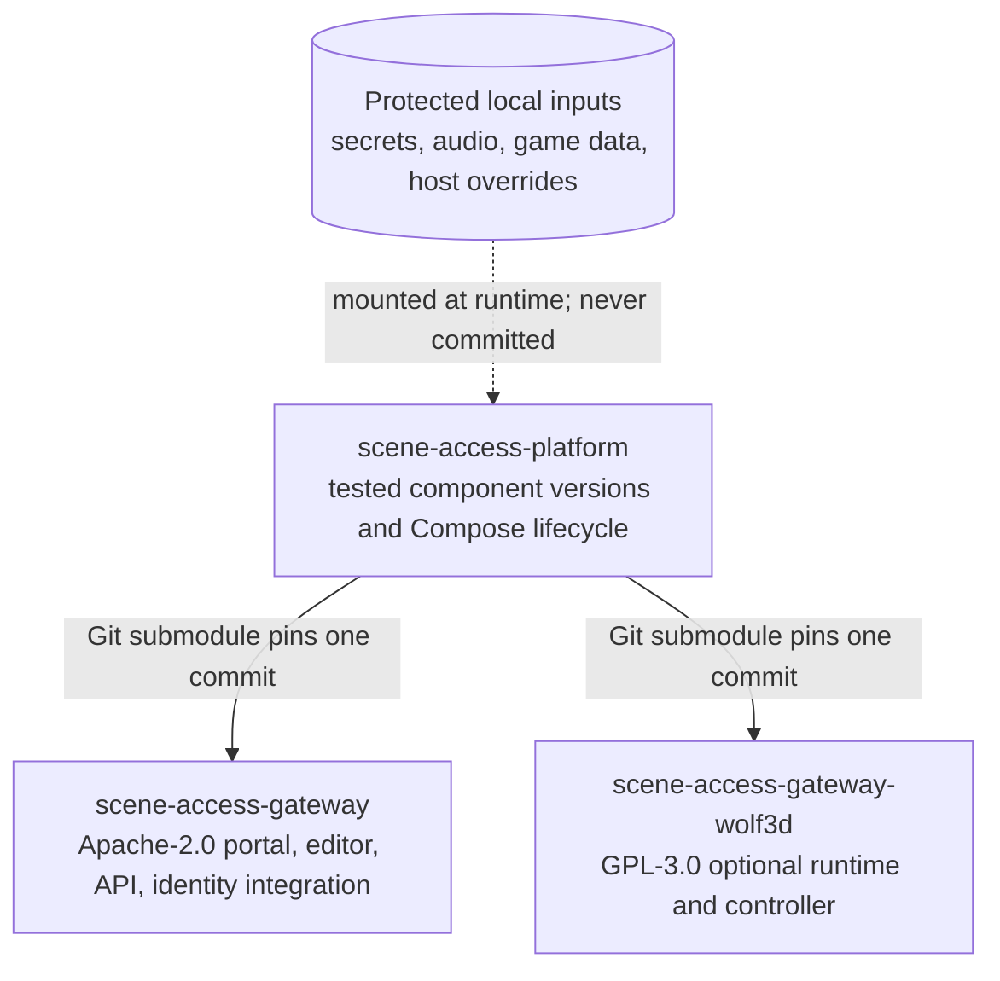

# Scene Access Platform

[](https://github.com/zipkindev/scene-access-platform/actions/workflows/ci.yml)
[](https://github.com/zipkindev/scene-access-gateway)
[](https://github.com/zipkindev/scene-access-gateway-wolf3d)
[](LICENSE)

Scene Access Platform is the integration workspace for the two independently
maintained repositories that make up the complete project:

- `gateway/` — the Apache-2.0 Scene Access Gateway portal, Scene Management,
  Authentik integration and portable frontend/backend containers;
- `wolf3d/` — the GPL-3.0 optional uWolf-derived Wolfenstein 3D and Spear of
  Destiny extension.

They are Git submodules rather than copied source trees. A platform commit
therefore records an exact, tested pair of gateway and extension commits while
each component keeps its own history, license, CI and release documentation.

This platform repository is the primary integration and operator entry point.
The component repositories remain independently accessible because Git must be
able to fetch them during a recursive clone; they should not be deleted or made
private while this repository is public and uses submodules.

## Architecture



The two submodule directories are not copied component source in the platform
history. The platform records one tested commit ID from each component. Inside
`gateway/` or `wolf3d/`, Git operates on that component repository; at the
platform root, Git sees only whether the recorded component pointer changed.
Bootstrap initializes missing submodules but preserves already initialized
component branches and working changes.

At runtime, Gateway supplies the public entrypoint and private backend. The
Wolf overlay adds read-only extension mounts. The platform scripts assemble
and validate that combination while local configuration and licensed data stay
outside every public repository.

## Clone

```sh
git clone --recurse-submodules https://github.com/zipkindev/scene-access-platform.git
cd scene-access-platform
./scripts/bootstrap.sh
```

For an existing clone:

```sh
git submodule update --init --recursive
```

Agents and automation must follow [`AGENTS.md`](AGENTS.md). Its preflight,
protected-data boundary, repository ownership, validation matrix and publish
order apply to the platform and both submodules. Verify the workspace layout
and ignore rules at any time with:

```sh
./scripts/check-workspace.sh
```

## Local configuration boundary

The gateway submodule owns the working `.env` and `.local/` paths. Its
bootstrap preserves existing values and creates safe defaults only when they
are absent. The same immutable images can then be combined with
different runtime configuration:

```text
gateway image + Wolf extension mounts + local Compose overlay + secrets/data
```

Optional local inputs remain in their owning repositories:

- gateway environment and audio: `gateway/.env` and `gateway/.local/audio-source/`;
- Wolf/Spear game data: `wolf3d/runtime/` through the extension importer;
- deployment override: `.local/compose.override.yaml`;
- GeoIP databases: `.local/geoip/` or another protected configured directory;
- TLS, Authentik, SMTP and alerting secrets: protected local mounts only.

None of those inputs belongs in this repository or either public child
repository.

## Validate, build and run

```sh
./scripts/test.sh
./scripts/build.sh
./scripts/up.sh
```

Default local endpoints are:

- portal: <http://localhost:8080>
- Scene Management: <http://localhost:8081>

Stop the stack with `./scripts/down.sh`.

The launch scripts automatically include `.local/compose.override.yaml` when
present. That file is the correct place for private proxy configuration,
secrets, certificates, storage mounts and environment-specific networks.

## Updating both repositories

Run `./scripts/update-components.sh` only when both submodules and the platform
repository are clean. It fast-forwards each component's `main`, runs the full
integration tests, and leaves the new submodule pointers ready for review and
a platform commit.

For a shared feature developed locally, create a branch inside the owning
submodule first. The platform can test that unpushed commit with the other
component before it is published. After its pull request is merged, fast-forward
the submodule to the final merge commit, rerun integration tests and commit the
new platform pointer. This is the supported local-to-public and
public-to-local synchronization path; do not maintain copied application files
in the platform repository.

The publish order is component first, platform second:

```text
component change -> component tests -> component commit/PR
                 -> platform integration test -> platform pointer commit
```

## Release ownership

| Repository | Owns |
| --- | --- |
| `scene-access-gateway` | Portal, Scene Management, security events, Authentik contracts, artwork and portable images |
| `scene-access-gateway-wolf3d` | GPL engine, CRT controller, game-data import and extension tests |
| `scene-access-platform` | Compatible commit pairing, combined Compose lifecycle, integration CI and operator documentation |

Production deployment is intentionally separate from Git synchronization. A
successful platform build or GitHub Actions run does not authorize or perform
a TrueNAS cutover.

## Licensing

The platform orchestration files are Apache-2.0. Each submodule retains and
enforces its own license. Commercial Wolfenstein 3D and Spear of Destiny game
data are user supplied and are never part of a repository or image release.
